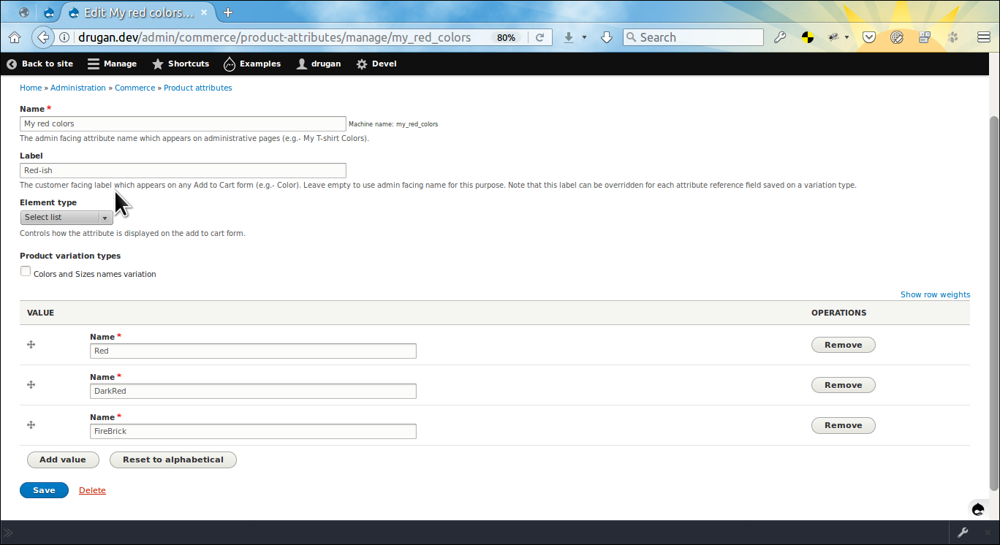
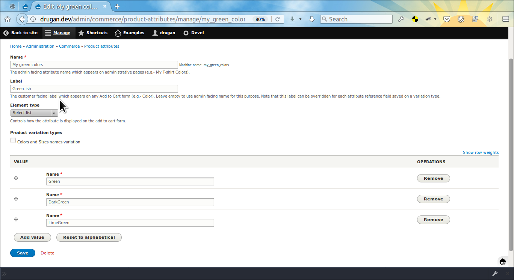
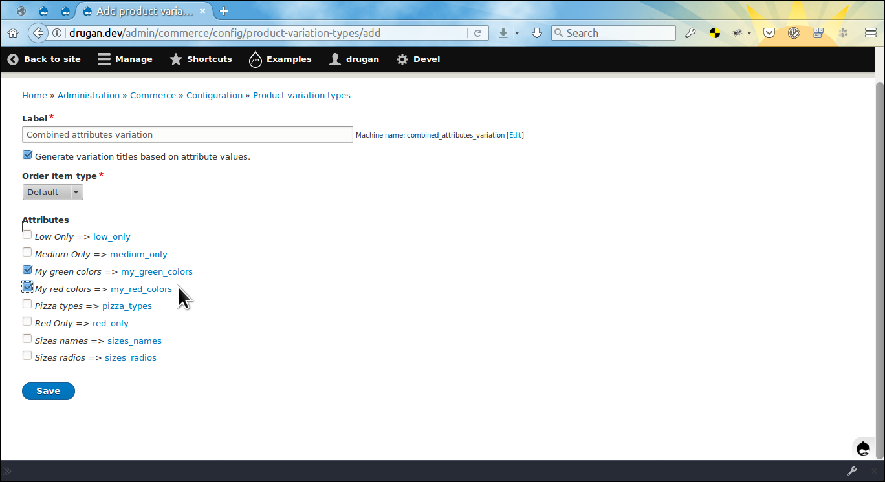
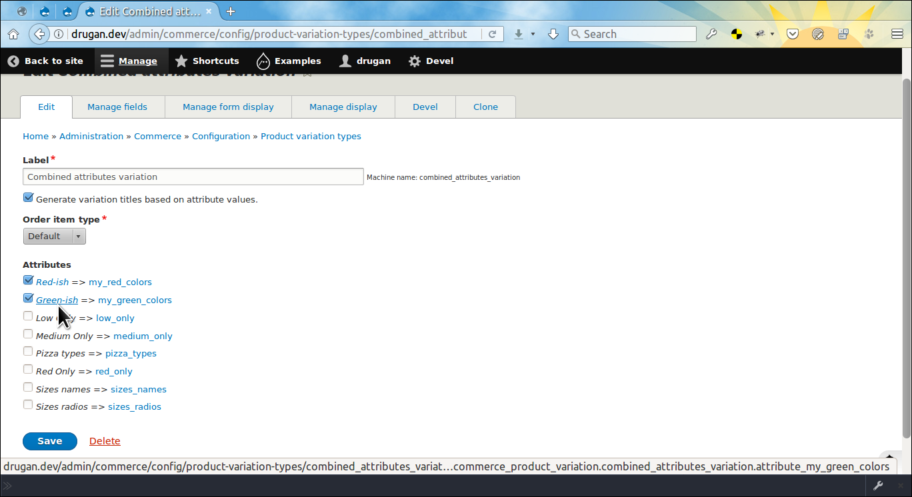
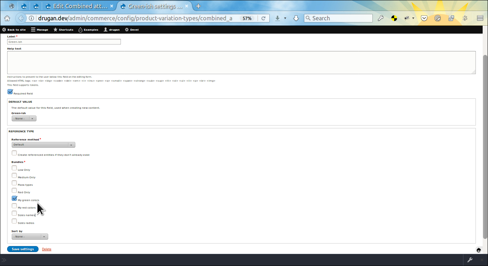
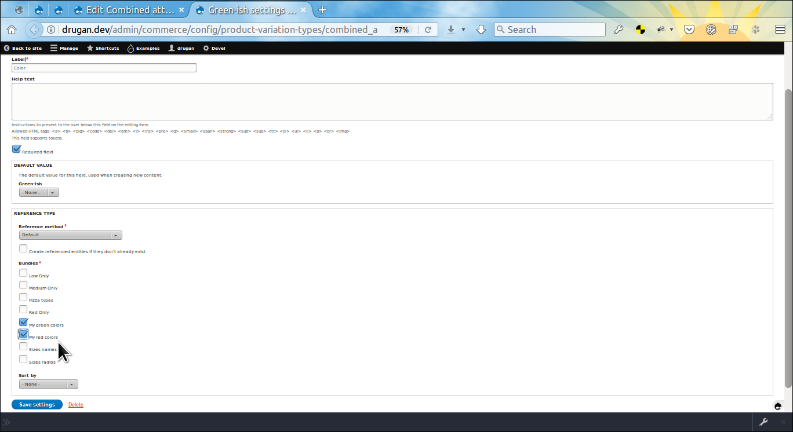
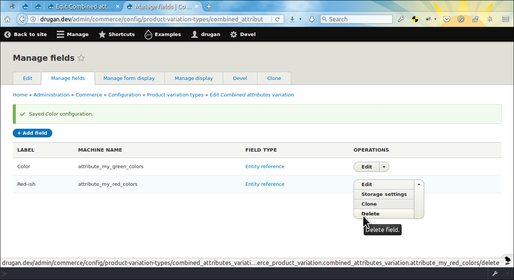
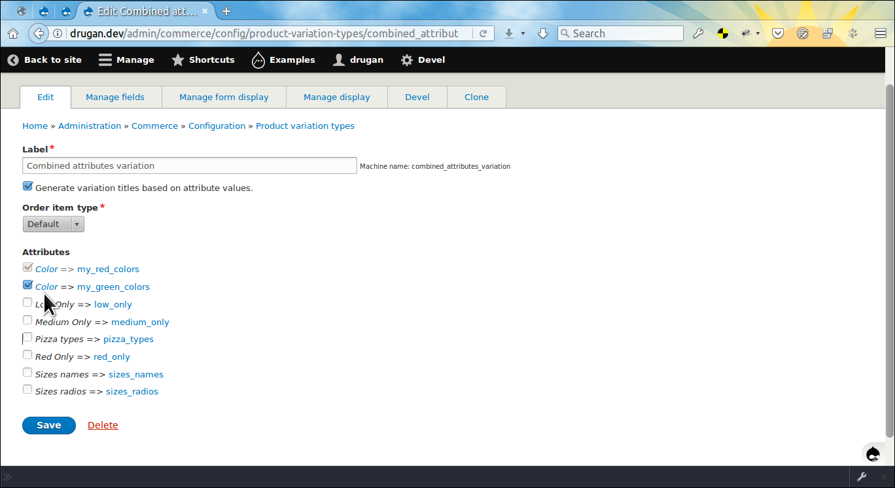
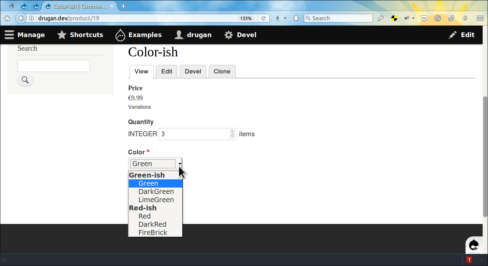

Commerce Correct Attributes
============================

Helps to correctly display attributes on an *Add to cart* form.
Introduces *No, thanks!* refuse option for optional attributes. Also, allows to
combine multiple attributes into one. Additionaly, attributes can be displayed
in [optgroups ↗](https://developer.mozilla.org/en-US/docs/Web/HTML/Element/optgroup#Result)
on the select element, each group having a label defined on the attribute add / edit form.

> Tip: you can see this file in your browser by clicking
the [admin/help#](#0 "? Help") link at the right of the *Admin toolbar* and then
the [admin/help/commerce_cattributes#](#0 "Commerce Correct Attributes") link in
the list.


The module was created as a solution for the following *Drupal Commerce* issues:

- [Issue \#2831739: Allow combined attributes ↗](https://www.drupal.org/node/2831739)
- [Issue \#1577602: Allow to use empty options in the product selector ↗](https://www.drupal.org/node/1577602)
- [Issue \#2707721: Incorrect display of attribute field values on the Add To Cart form ↗](https://www.drupal.org/node/2707721)
- [Issue \#2730643: Product variation attributes shows combines variations that not exist ↗](https://www.drupal.org/node/2730643)
- [Issue \#2897698: With a view catalog, only the first product variations works ↗](https://www.drupal.org/node/2897698)

Also, there is a bunch of attribute issues appearing when
multiple *Add to cart* forms displayed on a page. You can try to fix them by
additionally installing
the [Commerce Extended Quantity ↗](https://www.drupal.org/project/commerce_xquantity)
module along with the *Commerce Correct Attributes*.


________________________________________________________________________________

- [admin/help/commerce_cattributes#setup](#setup "Setup")
- [admin/help/commerce_cattributes#combined-attributes](#combined-attributes "Combined attributes")
- [admin/help/commerce_cattributes#module-author](#module-author "Module author")

## Setup

After installing the module go to an order item
type's *Manage form display* -> *Default* page and set
the *Correct attributes select list* widget for the *Purchased entity* field. As
an example the [admin/commerce/config/order-item-types/default/edit/form-display#](#0
"default order item type") is taken but actually could be any type. Note that if
the widget is not assigned the default settings will apply.


The *Correct attributes select list* widget settings' summary explained:

- **skip_option_label:** The label for optional attribute fields' refuse option
on an *Add to cart* form. For example, you may sell t-shirts with optional logo
printed on them. So, having
three *Drupal*, *Commerce* and *Drugan* logo options, a customer can choose the
fourth *No thanks!* option and get their t-shirt much clearer and also cheaper.
- **reorder_labels:** Move the selected by a customer option to the top of the
select list everytime when they make the selection. Helps to correctly display
attribute options after the action. Might be disabled if the attributes work
flawlessly without it.
- **no_options_label:** The label to display inside the disabled attribute field
on an *Add to cart* form when the option chosen by a customer on another
attribute does not have any respective option on the given one. For example, you
have *Red*, *Green*, *Blue* color options for a t-shirt but logo could be
printed only on *Red* and *Green* t-shirts so, when a customer
chooses *Blue* option, then there is *No options available* dummy option
displayed on the form.
- **show_optgroups:** Show attribute's customer facing label in the
select element as a group title. Might be used as an additional label for the
attribute on an *Add to cart* form or to just to distinct values combined on the
current attribute.
- **hide_no_options:** Hide an attribute field if there is no option on the
atrribute. Not recommended because it may introduce bad UX with a page jumping
everytime when a customer makes their choice. Instead set an
explanatory *No options available* dummy label.


## Combined attributes

> Mutiple attributes might be combined into one and appear on a variation type
as a standalone attribute field. You may need it to reduce the time ultimately
spent on attributes and product variations creation.

Let's say you have different product types on your site and each type requires
different color sets. So, *product_type_one* may have
only *Red*, *Green*, *Blue* colors
, *product_type_two* only *Green*, *Blue*, *Black*
, *product_type_three* only *Red*, *Black*, *White*, etc.. In order to reuse the
same colors on multiple product types you can create an attribute with all the
colors cited above and assign it to product types. So far, so good. Except one
important thing: each product has a bunch of irrelevant options on a variation
add / edit form. It is not an issue if you have just a few colors on the
attribute but that quite easily may turn into a real nightmare if the number of
colors on the site is a little more than a ton. Some sites may
use **[100+ ↗](https://dc2xdemo.websitework.space/products/category002/product-2002)** or
even **[200+ ↗](https://www.drupal.org/node/2932277)** colors in their work.

The solution might be to break the commonly used color attribute into smaller,
product type specific color sets. But eventually you'll face the same
issue again. For example, you have a type using its specific 20 colors set but
then there is a new product type, having 18 colors from the set and two
additional colors which are not in the set. You may add these two colors to the
set but in this case each product type will get two irrelevant colors in the
select list. Or, you may create a new 20 colors attribute but, as it was said,
that is the nightmare to repeat such a tedious work again and again.

Also, when bulk creating variations on a product add / edit form
the [Commerce Bulk ↗](https://www.drupal.org/project/commerce_bulk) uses all
possible attributes combinations, the irrelevant colors (sizes, etc.) including.
So, you need manually to remove all them before saving the product, which
assumes two clicks for each variation. One is `Remove` button and the second is
a confirmation: `are you sure?`. *YES, I AM SURE, PLEASE!*

To avoid those situations the *Commerce Correct Attributes* allows to create
multiple attributes with a single value and then combine only required
attributes on a variation type creation form into one single attribute field.
Or, you may create attributes each consisting of a smaller number of values and
combine those attributes the same way as above. Though it might be seen
as [much more work initially](https://www.drupal.org/project/commerce/issues/2916129#comment-12307268)
but in the future you'll save a lot of time spent on handling the attributes.

For testing purposes you can create a color attribute
having *Red*, *DarkRed* and *FireBrick* values and another attribute
having *Green*, *DarkGreen* and *LimeGreen* values. So, you may set
up *Red-ish* customer facing label for the first one and *Green-ish* for the
second.




________________________________________________________________________________

Now, let's create a variation type where the attributes will be combined. The
labels for attributes are presented in two parts: at the left we see the
admin name of the attribute and at the right the machine name linked to the
attribute edit page. Check
both *My green colors* and *My red colors* attributes and press `Save` button.



________________________________________________________________________________

After the form is saved the *My green colors* and *My red colors* names are
swapped with customer facing labels linked to the variation type attribute
reference field edit page. Now, click on any of the label links to make actual
combining of attributes.



________________________________________________________________________________

As you see, the customer facing label is pre-populated for the attribute field
and *My green colors* attribute is chosen by default.



________________________________________________________________________________

Let's add the *My red colors* attribute and change the *Green-ish* label
for *Color* as it has more sense for combined colors when displaying them on
an *Add to cart* form. At the same time the *Green-ish* label will be used later
for the respective colors' optgroup on the select element. Press `Save settings`
button.



________________________________________________________________________________

Now, the *Red-ish* attribute field have to be deleted as it does not need any
more because its values were combined with the *Green-ish* (now *Color*)
attribute.



________________________________________________________________________________

After the field is deleted visit the variation type edit page again to check if
everything is as expected. Note that now the *Color* links point to the same
attribute reference field on the variation type but machine names at the right
point to the different attributes.



________________________________________________________________________________

See how the combined attributes' field looks like on the *Add to cart* form.



_______________________________________________________________________________


###### Module author:
```
  Vlad Proshin (drugan)
  [proshins@gmail.com](proshins@gmail.com)
  [https://drupal.org/u/drugan](https://drupal.org/u/drugan)
```
